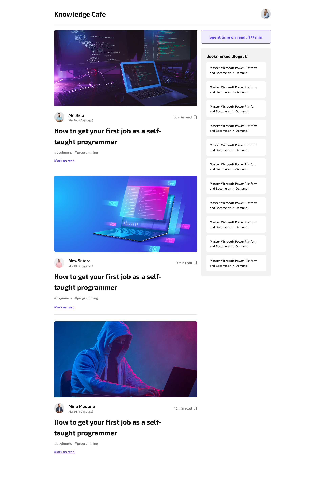

# pghero-assignment8
This project is a clone of the following design. 

## Learning Outcome
1. Basic React
2. React toast

## Resource Link
[Click here](https://github.com/ProgrammingHero1/knowledge-cafe)

## Fake data Link
[Click here](https://github.com/anik-chy/fake-blog-data)

## Live Website Link
[Click here](https://helpful-stardust-299d59.netlify.app/)

## Helpful Resources
- [Toast Notification](https://youtu.be/NHlExjLI-d0)